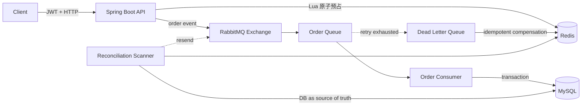

<div align="center">

# High Concurrency Seckill

**Redis Lua 原子预占 · RabbitMQ 异步削峰 · MySQL 最终落库**

一个聚焦「不超卖、不重复下单、异常可收敛」的高并发秒杀后端。

[](https://github.com/Jiyun-he/seckill/actions/workflows/ci.yml)
[](https://openjdk.org/projects/jdk/17/)
[](https://spring.io/projects/spring-boot)
[](doc/testing.md)
[](LICENSE)

[ 快速开始 ](#-快速开始) · [ 架构设计 ](#-架构设计) · [ 测试与故障注入 ](#-测试与故障注入) · [ 贡献指南 ](CONTRIBUTING.md)

</div>

---

## ✨ 项目亮点

| 热路径设计 | 一致性保障 | 故障恢复 | 工程化验证 |
| --- | --- | --- | --- |
| 资格校验、一人一单与库存扣减在单次 Redis Lua 中原子完成 | Redis 预占、MQ 投递、MySQL 落库通过状态机与幂等策略协同 | 即时补偿、死信补偿、定时对账分别覆盖不同失败窗口 | 32 个 Testcontainers 用例 + 5 类 Failpoint + JMeter 压测与压后核验 |

与只展示「Redis 扣库存 + MQ 异步落库」的 Demo 不同，本项目主要回答一个更具体的问题：**在消息退回、confirm 回音丢失、消费者崩溃、重复消费与 Redis / DB 库存漂移时，订单如何最终回到可解释的终态。**

## 🏗️ 架构设计



### 一次秒杀请求如何流转

1. 启动时将活动时间与库存预热到 Redis。
2. Lua 在一次执行中完成时间校验、一人一单查重、扣库存与预占状态写入。
3. API 将订单事件投递到 RabbitMQ，立即返回雪花订单号，同步路径不访问 MySQL。
4. 消费者在事务中写入订单并条件扣减 DB 库存，提交后将预占状态置为 `CONSUMED`。
5. 不可判定的投递结果保留为中间态，对账任务以 MySQL 事实为准重投或补偿。

### 核心不变式

| 目标 | 实现 |
| --- | --- |
| 不超卖 | Lua 原子扣减 + MySQL `stock >= 1` 条件更新双重防线 |
| 一人一单 | Lua 原子查重 + Redis Set + DB 唯一索引 `uk_user_seckill` |
| 不重复落库 | `order_no` 幂等检查 + 数据库唯一约束 |
| 不误补偿 | 只对「能证明消息未入队」的结果立即补偿；未知结果交给对账 |
| 终态不回退 | `FAILED` / `CONSUMED` 为权威终态，晚到 confirm 回调不得覆盖 |

> 详细的失败窗口、状态机与取舍见 [一致性设计](doc/consistency.md)。

## 🧩 技术栈

| 领域 | 选型 |
| --- | --- |
| 应用层 | Java 17, Spring Boot 3.5.3, Spring Web MVC |
| 数据层 | MySQL 8.0, MyBatis-Plus 3.5.15 |
| 高并发链路 | Redis 6, Lua, RabbitMQ |
| 安全与接口 | JWT, BCrypt, Jakarta Validation, Knife4j / OpenAPI |
| 测试与运行 | JUnit 5, Testcontainers, JMeter, Docker Compose, GitHub Actions |

## 🚀 快速开始

### 前置条件

- Docker Desktop 或 Docker Engine，支持 Docker Compose v2
- Git

### 启动完整环境

```bash
git clone https://github.com/Jiyun-he/seckill.git
cd seckill
cp .env.example .env
docker compose up -d --build
```

Docker 会在多阶段构建中自动编译应用，无需本机预装 Maven。启动后可访问：

| 服务 | 地址 |
| --- | --- |
| 健康检查 | `http://localhost:8080/actuator/health` |
| 交互式 API 文档 | `http://localhost:8080/doc.html` |
| RabbitMQ Management | `http://localhost:15672` |

> PowerShell 可使用 `Copy-Item .env.example .env`。`.env.example` 仅用于本地演示，非本地环境请先替换其中凭据与 `JWT_SECRET`。

### 试一次秒杀

```bash
# 1. 注册并从响应 data 字段取得 token
curl -X POST http://localhost:8080/user/register \
  -H 'Content-Type: application/json' \
  -d '{"username":"demo","password":"123456"}'

# 2. 提交秒杀；返回订单号时代表「已受理」
curl -X POST http://localhost:8080/seckill/do/1 \
  -H 'Authorization: Bearer <token>'

# 3. 轮询状态，直到 PROCESSING 收敛为 CONSUMED 或 FAILED
curl http://localhost:8080/seckill/order/<orderNo> \
  -H 'Authorization: Bearer <token>'
```

更多启动、本地调试与环境变量说明见 [开发与部署](doc/development.md)。

## 🧪 测试与故障注入

| 类别 | 覆盖内容 | 入口 |
| --- | --- | --- |
| 自动化回归 | 32 个用例，覆盖 Lua 原子性、HTTP 语义、MQ 回调、消费落库、对账与库存预热 | `./mvnw test` |
| 故障注入 | 在发送前、插入前、事务提交后、补偿后等精确窗口阻塞或抛错 | `fault-test` profile |
| 一致性压测 | 少库存竞争、单用户重复请求、混合重复流量，压后核验 DB / Redis / MQ | `test/run_consistency.py` |
| 容量实验 | 性能阶梯与消费并发度对照 | `test/run_performance.py` |

自动化测试使用 Testcontainers 拉起隔离的 MySQL / Redis / RabbitMQ，本机需有可用的 Docker 守护进程。详细用例分布见 [测试文档](doc/testing.md)，压测脚本用法见 [`test/README.md`](test/README.md)。

## 🗂️ 项目结构

```text
seckill/
├── .github/                       # CI、提交信息检查与 PR 模板
├── CONTRIBUTING.md                # 贡献、代码风格与 Commit 规范
├── doc/                           # 架构、一致性、API、数据模型等文档
├── docker/mysql/init/             # MySQL 建表与演示数据
├── src/main/java/.../seckill/
│   ├── controller/                # REST 接口层
│   ├── service/                   # 业务服务、MQ 消费与对账任务
│   ├── mapper/                    # MyBatis-Plus 数据访问
│   ├── entity/ dto/ vo/ converter/# 边界模型与转换
│   ├── config/                    # Redis / RabbitMQ / Web / MyBatis-Plus
│   └── fault/                     # 仅测试 profile 生效的 Failpoint
├── src/test/                      # Testcontainers 集成测试
├── test/                          # JMeter、压测编排与故障注入脚本
├── compose.yaml
└── Dockerfile                     # 编译 + 非 root 运行的多阶段镜像
```

## 📖 文档导航

| 文档 | 适合了解 |
| --- | --- |
| [架构与核心链路](doc/architecture.md) | 分层、组件边界、认证 / 普通下单 / 秒杀链路 |
| [一致性设计](doc/consistency.md) | Lua 预占、状态机、投递可靠性、补偿与对账 |
| [数据模型](doc/data-model.md) | MySQL 表与索引、Redis 键空间、RabbitMQ 拓扑 |
| [API 参考](doc/api.md) | 接口、响应语义与调用示例 |
| [开发与部署](doc/development.md) | 环境变量、Docker 部署、IDE 调试与目录说明 |
| [测试](doc/testing.md) | 回归测试、Failpoint、压测和手工验证 |
| [路线图](doc/roadmap.md) | 已知边界与后续方向 |
| [贡献指南](CONTRIBUTING.md) | 分支、代码风格、Commit 约定与 PR 清单 |

## 📌 当前边界

项目当前聚焦于「秒杀交易链路的正确性」，而非完整电商产品：尚未实现支付 / 取消 / 超时关单、前端页面、接入层限流，中间件默认也是单实例编排。这些限制不隐藏，已在 [路线图](doc/roadmap.md) 中明确记录。

## 🤝 贡献

仓库使用 Spotless 自动统一 Java 格式，提交消息遵循 Conventional Commits，两者均由 CI 校验。分支、代码风格、测试要求与 PR 清单见 [CONTRIBUTING.md](CONTRIBUTING.md)。

## License

This project is licensed under the [Apache License 2.0](LICENSE).
